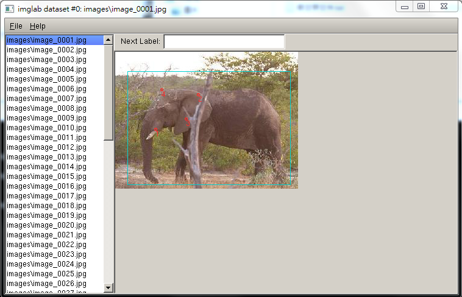

# Training Model


## imglab
Dlib有提供一個 tool叫 imglab可以幫助製作訓練用的數據,安裝方式如下
需先安裝cmake ...

```
    cd dlib/tools/imglab
    mkdir build
    cd build
    cmake ..
    cmake --build . --config Release
```
安裝成功後，可以到 dlib/tools/imglab/build中找到 imglab檔案

執行 imglab -c xml_file img_folder

```
    imglab -c train_data.xml ./images
```
執行後會產生train_data.xml,裡面內容包含images所有圖片資訊

```xml
<?xml version='1.0' encoding='ISO-8859-1'?>
<?xml-stylesheet type='text/xsl' href='image_metadata_stylesheet.xsl'?>
<dataset>
<name>imglab dataset</name>
<comment>Created by imglab tool.</comment>
<images>
  <image file='images\image_0001.jpg'>
  </image>
  <image file='images\image_0002.jpg'>
  </image>
  <image file='images\image_0003.jpg'>
  </image>
  <image file='images\image_0004.jpg'>
  </image>
 
  ...
</images>
 ```
  
執行
```
    imglab train_data.xml
```


按著 Shift + 滑鼠左鍵選取要捕捉的部分。選錯用滑鼠左鍵雙擊紅色框框，框框變青色按delete刪除


在 Menu/File裡點擊 Save，就可以把剛剛的標注儲存在 mydataset.xml中。
  
  
  
如果需要對一些特徵進行標注。接續著剛的 mydataset.xml繼續處理。假設僅對圖像標註五個特徵。
./imglab train_data.xml --parts "1 2 3 4 5"
  
  
  
  
可以發現train_data.xml 與原本多了box tag
  
```xml
<?xml version='1.0' encoding='ISO-8859-1'?>
<?xml-stylesheet type='text/xsl' href='image_metadata_stylesheet.xsl'?>
<dataset>
<name>imglab dataset</name>
<comment>Created by imglab tool.</comment>
<images>
  <image file='images\image_0001.jpg'>
    <box top='46' left='35' width='261' height='171'/>
  </image>
  <image file='images\image_0002.jpg'>
    <box top='35' left='45' width='184' height='128'/>
  </image>
  <image file='images\image_0003.jpg'>
    <box top='58' left='38' width='241' height='167'/>
  </image>
  <image file='images\image_0004.jpg'>
    <box top='42' left='36' width='241' height='169'/>
  </image>
  <image file='images\image_0005.jpg'>
    <box top='12' left='6' width='285' height='163'/>
  </image>
  <image file='images\image_0006.jpg'>
    <box top='14' left='14' width='255' height='175'/>
  </image>
  <image file='images\image_0007.jpg'>
    <box top='64' left='38' width='183' height='205'/>
  </image>
  ...
```  
  
## traning data
這邊將testdata測試註解 
```python

# -*- coding: utf-8 -*-
import os
import sys
import glob
import dlib
import cv2

# options用於設置訓練的參數和模式
options = dlib.simple_object_detector_training_options()
# Since faces are left/right symmetric we can tell the trainer to train a
# symmetric detector.  This helps it get the most value out of the training
# data.

options.add_left_right_image_flips = True


# 支持向量機的C參數，通常默認取為5.自己適當更改參數以達到最好的效果
options.C = 5
# 線程數，你電腦有4核的話就填4
options.num_threads = 4
options.be_verbose = True


current_path = os.getcwd()
train_folder = current_path + '/elephant_train/'
#test_folder = current_path + '/elephant_test/'
train_xml_path = train_folder + 'train_data.xml'
#test_xml_path = test_folder + 'elephant.xml'

print("training file path:" + train_xml_path)
# print(train_xml_path)
#print("testing file path:" + test_xml_path)
# print(test_xml_path)


print("start training:")
dlib.train_simple_object_detector(train_xml_path, 'detector.svm', options)

print("")  # Print blank line to create gap from previous output
print("Training accuracy: {}".format(
    dlib.test_simple_object_detector(train_xml_path, "detector.svm")))

# print("Testing accuracy: {}".format(
    # dlib.test_simple_object_detector(test_xml_path, "detector.svm")))
 

```
## test data
```python

import os
import sys
import dlib
import cv2
import glob

detector = dlib.simple_object_detector("detector.svm")

current_path = os.getcwd()
test_folder = current_path + '/elephant_test/images/'

print (test_folder)

for f in glob.glob(test_folder+'*.jpg'):
    print("Processing file: {}".format(f))
    img = cv2.imread(f, cv2.IMREAD_COLOR)
    b, g, r = cv2.split(img)
    img2 = cv2.merge([r, g, b])
    dets = detector(img2)
    print("Number of faces detected: {}".format(len(dets)))
    for index, face in enumerate(dets):
        print('face {}; left {}; top {}; right {}; bottom {}'.format(index, face.left(), face.top(), face.right(), face.bottom()))

        left = face.left()
        top = face.top()
        right = face.right()
        bottom = face.bottom()
        cv2.rectangle(img, (left, top), (right, bottom), (0, 255, 0), 3)
    cv2.namedWindow(f, cv2.WINDOW_AUTOSIZE)
    cv2.imshow(f, img)

k = cv2.waitKey(0)
cv2.destroyAllWindows()


```
  